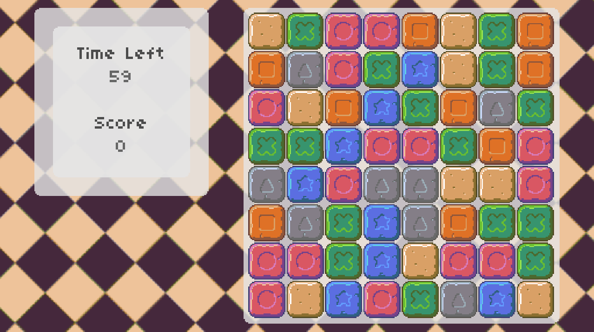

Match 3 is a Bejeweled clone created using [LÖVE][love] 11.3 for educational purposes. It's free, open-source, and works on Windows, macOS and Linux.

Builds
------

Files for releases are in the [releases][releases] section on GitHub.

Compilation
-----------

Please follow the instructions at the [LÖVE][love] website.

[love]: https://love2d.org/
[releases]: https://github.com/iury/love2d_games/releases
